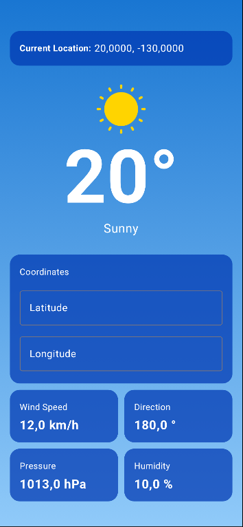

# Assignment 3 - Annotations, MVVM and Jetpack Compose
**Course:** LEIM

**Student:** A51692

**Date:** May 3rd, 2026

**Repository URL:** https://github.com/gooberW/DAM

---

## Table of Contents

- [Assignment 3 - Annotations, MVVM and Jetpack Compose](#assignment-3---annotations-mvvm-and-jetpack-compose)
  - [Table of Contents](#table-of-contents)
  - [1. Introduction](#1-introduction)
  - [2. System Overview](#2-system-overview)
  - [3. Architecture and Design](#3-architecture-and-design)
  - [4. Implementation](#4-implementation)
    - [4.1. Annotations and Annotations Processors](#41-annotations-and-annotations-processors)
      - [Annotations](#annotations)
      - [Annotation Processors](#annotation-processors)
      - [Challenge](#challenge)
    - [4.2. Jetpack Weather App (Android)](#42-jetpack-weather-app-android)
- [Development Process](#development-process)
  - [5. Version Control and Commit History](#5-version-control-and-commit-history)
  - [6. AI Usage Disclosure (Mandatory)](#6-ai-usage-disclosure-mandatory)

---

## 1. Introduction
This assignment builds on prior work with the Kotlin programming language and the Android development environment. The goal was to gain practical experience with three interconnected topics: annotations and annotation processors, code generation in Kotlin, and building modern Android UIs using Jetpack Compose under the MVVM architectural pattern.

## 2. System Overview
The project is structured around two main areas of focus.

The first covers annotations in Kotlin. This section introduced the creation and use of custom annotations, the role of annotation processors in analysing them at compile time, and how processors can drive automatic code generation. As a concluding challenge, a RegEx annotation processor was implemented from scratch.

The second area concerns Android development with MVVM and Jetpack Compose. The task was to rebuild a previously developed Weather App, this time applying the Model-View-ViewModel pattern and replacing the traditional View system with Jetpack Compose for a more modern UI approach.

## 3. Architecture and Design
A modular package structure was used to keep exercises isolated and maintainable. This ensures that the namespace for each exercise remains clean.

> Diagram 1. Directory diagram of Kotlin exercises project structure.
```
dam_tp3/
├── annotations/src/.../
│    └── annotations/src/.../
│         └── Extract.kt
│         └── Greeting.kt
├── app/src/.../
│   ├── app/src/.../
│   |    └── Main.kt
│   |    └── MyClass.kt
│   └── regex/src/.../
│       └── DataProcessor.kt
│       └── Main.kt
└── processor/src/.../
   └── processor/src/.../
        └── ExtractProcessor.kt
        └── GreetingProcessor.kt

```

## 4. Implementation
### 4.1. Annotations and Annotations Processors

This exercise explores the creation of custom annotations in Kotlin and the use of annotation processors to analyse them at compile time and automatically generate new source code.

#### Annotations

Two custom annotations were defined in the annotations package, both targeting functions (``@Target(AnnotationTarget.FUNCTION)``) and with ``SOURCE`` retention, meaning they are discarded after compilation and do not appear in the compiled bytecode.
``@Greeting`` takes a ``message: String`` parameter and is intended to mark methods that should be preceded by a printed greeting when called. ``@Extract`` takes a ``regex: String`` parameter and marks abstract methods whose implementations should be generated to extract a value from a string input using the provided regular expression.


#### Annotation Processors

Two processors were implemented, both extending ``AbstractProcessor`` and using ``@AutoService`` for automatic registration and KotlinPoet for code generation.

The ``GreetingProcessor`` scans for all methods annotated with ``@Greeting`` and, for each class containing them, generates a wrapper class using composition. The wrapper holds a reference to the original class instance and, for each annotated method, generates a corresponding method that first prints the greeting message defined in the annotation, then delegates the call to the original method. In ``MyClass``, both ``sayHello`` and compute are annotated, so the processor generates a ``MyClassWrapper`` class. The ``main`` function then instantiates ``MyClass``, wraps it in ``MyClassWrapper``, and calls the methods through the wrapper.

The ``ExtractProcessor`` scans for methods annotated with ``@Extract`` and generates a concrete subclass of the annotated abstract class. For each annotated method, it generates an override that applies the regex from the annotation to the input constructor parameter and returns the first capture group, or null if there is no match. Applied to ``DataProcessor``, this generates ``DataProcessorExtractor``, which the main function in the regex package instantiates directly to extract the name and address from an input string.

Both processors write their generated files to the ``kapt.kotlin.generated`` directory, which is the standard output path for KAPT-based Kotlin code generation.


#### Challenge
The RegEx challenge (``@Extract``) required generating not just delegation logic like ``@Greeting``, but actual functional implementations of abstract methods. Each generated override had to apply a different regex, taken from the annotation parameter, to a shared input string and return the matched group. This was achieved by having the generated class extend the abstract ``DataProcessor`` and override each method with the appropriate ``Regex(...).find(input)?.groupValues?.get(1)`` logic, built using KotlinPoet's ``addStatement`` API.

### 4.2. Jetpack Weather App (Android)

The Jetpack Weather App is the continuation of the previous assignment. This time, the app follows the MVVM design pattern and uses Jetpack Compose for its UI.

The app is structured into three layers. The data layer contains the model classes (``WeatherData``, ``CurrentWeather``, ``Hourly``) which are Kotlin data classes annotated with ``@Serializable`` to enable automatic JSON deserialization via ``kotlinx.serialization``. The ``WeatherApiClient`` object uses Ktor's ``HttpClient`` with the ``CIO`` engine and the ``ContentNegotiation`` plugin to perform HTTP GET requests to the Open-Meteo API, fetching current weather and hourly data for a given latitude and longitude.

The ViewModel layer (``WeatherViewModel``) extends Android's ViewModel and holds the UI state as a ``MutableStateFlow<WeatherUIState>``, exposed as an immutable ``StateFlow``. This ensures the UI always reflects the latest state reactively. The ViewModel exposes ``updateLatitude``, ``updateLongitude``, and ``fetchWeather`` methods. Fetching is done inside a ``viewModelScope`` coroutine, which keeps the network call off the main thread and ties its lifecycle to the ViewModel. On a successful response, the state is updated atomically via ``update { it.copy(...) }``.

The UI layer is built entirely with Jetpack Compose. The root composable ``WeatherUI`` collects the ``StateFlow`` using ``collectAsState()`` and reacts to state changes automatically. It also detects device orientation via ``LocalConfiguration`` and delegates rendering to either ``PortraitWeatherUI`` or ``LandscapeWeatherUI``, sharing all data through a ``WeatherUIProps`` data class to avoid prop drilling across multiple composables.

The UI is composed of several reusable composables: ``TemperatureCard`` displays the weather icon, temperature, and description; ``InfoGrid`` lays out wind speed, wind direction, pressure, and humidity in a 2×2 grid of ``InfoCard`` composables; ``CoordsCard`` contains two ``OutlinedTextField`` inputs for the user to enter coordinates; ``LocationCard`` shows the current coordinates; and ``UpdateButton`` triggers a new API fetch. The background gradient is dynamically computed by ``WeatherUtils.getWeatherBackground``, which maps WMO weather codes and the ``is_day`` flag to appropriate colour pairs, giving the app a context-aware visual appearance.

The utility object ``WeatherUtils`` also handles mapping weather codes to icons and descriptions by looking up resource arrays (``R.array.weather_codes``, ``R.array.weather_icons``, ``R.array.weather_descriptions``), keeping all weather-code logic centralised and easy to extend.

The UI can be viewed in Figure 1.

</img>
> Figure 1. Weather App UI using Jetpack Compose.

---

# Development Process
## 5. Version Control and Commit History
GitHub Desktop was used throughout the development process. Commits were made after the completion of each feature (e.g., "Add custom setter for Book class," "Implement calculator boolean logic"). This ensures the evolution of the code is tracked and can be reverted to stable versions if regressions occur.

> Note: Some commits only include progress checkpoints with unfinished code.

## 6. AI Usage Disclosure (Mandatory)
Artificial Intelligence was only used to draft this report, namely ``Claude`` and ``ChatGPT``. All code in this project was developed manually, with assistance from official documentation.
